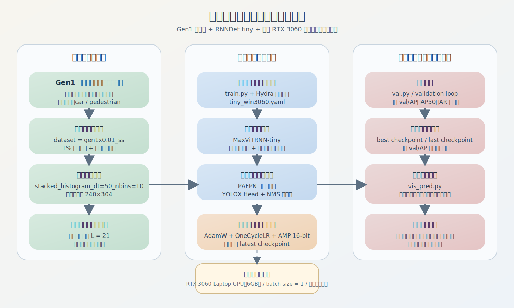
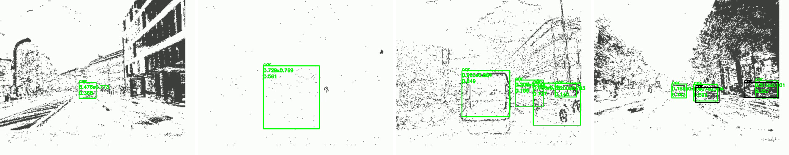
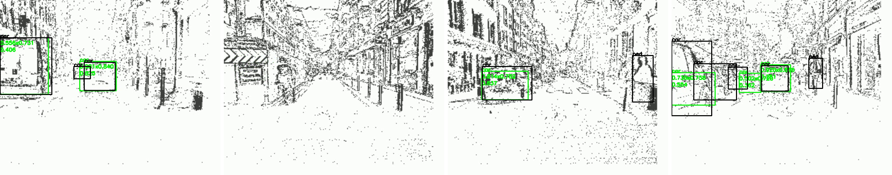

# 强化特征建模的高效事件视觉目标检测方法

## 摘要

事件相机以异步事件流的形式记录场景亮度变化，相较于传统帧式相机，具有高时间分辨率、高动态范围、低延迟和低功耗等优势，在智能交通、机器人感知、高速目标跟踪和复杂光照环境视觉感知等场景中展现出较高应用潜力。然而，事件数据并不直接形成规则图像，而是由大量离散事件构成，具有明显的稀疏性、噪声性和时序性。这使得传统面向 RGB 图像设计的目标检测模型难以直接迁移到事件视觉任务中，也使事件视觉目标检测在特征表达、时序建模、多尺度融合和轻量化部署等方面面临新的挑战。

围绕上述问题，本文以“强化特征建模的高效事件视觉目标检测方法”为主题，结合事件视觉目标检测的实际应用需求，在现有轻量化检测框架基础上，对事件流输入表示、时序主干特征提取、多尺度特征融合以及工程部署流程进行了系统梳理和设计。论文首先总结了事件相机成像机理与事件流表示方法，分析了事件目标检测任务与传统图像目标检测任务之间的主要差异；然后围绕高效检测目标，构建了以 `RNNDet tiny` 为核心的实验基线，并在 `Gen1` 数据集上完成了本地环境适配、训练流程打通、断点续训、推理可视化和阶段性结果验证；最后结合实际训练与可视化结果，对当前模型性能、存在问题以及后续优化方向进行了分析。

在工程实现方面，本文完成了 `Windows + Conda + PyTorch + CUDA` 的本地实验环境搭建，训练设备为 `NVIDIA GeForce RTX 3060 Laptop GPU`，显存容量为 `6GB`。实验采用 `Gen1` 事件视觉目标检测数据集，数据表示方式为 `stacked_histogram_dt=50_nbins=10`，训练配置为 `gen1x0.01_ss`，即在 1% 标注比例的弱监督设定下开展阶段性实验。实际训练过程中，模型能够稳定完成数据读取、前向传播、损失回传、模型保存与自动续训。根据当前保存的 checkpoint，模型在验证阶段获得了 `val/AP=0.1270` 的阶段性最优结果，最佳权重文件为 `epoch_001-step_81756-val_AP_0.1270.ckpt`。进一步的测试集样例可视化结果表明，当前模型已经能够在典型道路场景下识别中等尺度车辆和部分行人目标，说明当前训练链路与检测流程是有效的；但在远距离目标、小尺度目标和复杂噪声背景条件下，仍存在漏检、误检与定位偏差等问题。

总体而言，本文当前工作已经完成了事件视觉检测课题从“方案准备”到“阶段性实验验证”的过渡，建立了可复现、可继续扩展的实验基线，并为后续围绕强化特征建模开展模块改进、消融分析和完整量化评估奠定了基础。本文的研究过程表明，在有限标注和有限算力条件下，基于轻量化时序检测框架的事件视觉目标检测是可行的，但要进一步提升性能，仍需要在事件表示质量、小目标特征增强、噪声鲁棒性和训练策略优化等方面继续深入研究。

**关键词**：事件视觉；事件相机；目标检测；特征建模；轻量化网络；时序建模

---

## 第一章 绪论

### 1.1 研究背景

近年来，随着自动驾驶、机器人感知、无人系统和智慧交通等技术的发展，视觉感知系统对于实时性、鲁棒性和环境适应性的要求不断提升。传统帧式相机通过固定频率输出整帧图像，已经在目标检测、场景理解和视频分析等领域取得了广泛应用。但在高速运动、强弱光交替、逆光或低照度等环境中，传统帧相机会出现运动模糊、曝光不稳定和冗余数据较多等问题，从而影响后续目标检测算法的性能。

事件相机是一类不同于传统帧式相机的新型视觉传感器。它并不是周期性输出完整图像，而是仅在像素亮度变化达到阈值时触发事件，并记录事件发生位置、时间和极性信息，即 `(x, y, t, p)`。这种工作机制使事件相机天然具有微秒级时间分辨率、较高动态范围以及较低数据冗余度，因此特别适合高速运动和复杂光照条件下的动态场景感知任务。

然而，事件相机数据的优势并不会自动转化为检测性能。由于事件流并非规则的二维图像数据，直接使用现有图像检测网络往往难以充分利用事件的时序特性。另一方面，事件数据在静止区域往往非常稀疏，在快速运动边缘区域则高度集中，同时还容易受到背景闪烁、传感器噪声和时间窗划分方式的影响。这意味着事件视觉目标检测并不是传统目标检测任务的简单替代，而是一个既具有视觉检测属性，又具有时序信号处理特征的交叉研究问题。

在这一背景下，如何在兼顾计算效率的同时强化事件特征建模能力，成为事件视觉目标检测研究的重要方向。一方面，特征建模不足会导致模型难以区分有效事件与噪声事件；另一方面，过于复杂的模型结构又会降低实时性，难以满足边缘设备部署需求。因此，本文以“强化特征建模的高效事件视觉目标检测方法”为题，围绕事件表示、时序建模和轻量化部署三者之间的平衡关系展开研究和实践。

### 1.2 研究意义

本课题的研究意义主要体现在理论价值和应用价值两个层面。

从理论层面看，事件视觉目标检测涉及事件表示学习、时序信息建模、多尺度视觉特征融合和轻量化目标检测等多个方向，是人工智能、机器视觉和智能感知交叉融合的重要研究主题。传统图像检测模型通常围绕空间纹理和静态语义展开，而事件视觉模型则需要同时关注时间维度上的变化信息。因此，对事件视觉目标检测方法进行研究，有助于扩展视觉检测任务的研究边界，并推动对非传统视觉传感器数据建模方式的理解。

从应用层面看，事件相机在高速、强动态和低照度场景中具有天然优势。若能够构建有效的事件目标检测方法，就有望将其应用于自动驾驶前向感知、工业高速检测、无人机导航、机器人避障、安防监控和智能交通等场景。在这些应用中，系统往往不仅要求检测准确，还要求响应迅速、模型可部署、对环境变化具有鲁棒性。因此，“强化特征建模”和“高效检测”并不是两个彼此独立的目标，而是必须同时考虑的现实需求。

此外，对于本科毕业设计而言，本课题还具有较强的工程实践价值。通过完成数据集整理、环境搭建、模型训练、脚本调试、可视化分析和论文整理，可以系统锻炼从理论理解到工程落地的完整能力。尤其是在本地单卡资源有限的前提下完成阶段性实验验证，更能够体现工程实现与问题排查能力。

### 1.3 国内外研究现状

事件视觉目标检测是近年来事件相机研究中最具代表性的高层视觉任务之一。与事件去噪、重建、光流估计等底层任务相比，目标检测不仅要求模型能够从异步事件流中提取时空特征，还要求其具备稳定的语义判别能力与较好的检测效率。因此，如何在事件数据稀疏、异步和噪声干扰明显的条件下构建兼顾精度与速度的检测模型，已经成为国内外研究的重要方向。

#### 1.3.1 基于帧重建或帧辅助的事件检测方法

较早的事件检测方法通常采用“先重建、再检测”或“先转帧、再检测”的思路，即先将一段时间窗内的事件累积为事件帧、时间表面、二值直方图，甚至进一步重建为灰度图像，再接入常规卷积检测器。这类方法的优点在于可以较好复用传统图像检测框架，工程实现相对简单，也便于借助已有图像检测经验快速建立基线。然而，这一路线也存在明显局限：其一，事件流的异步时序信息在投影或重建过程中容易被压缩甚至丢失；其二，重建误差会进一步传递到检测阶段；其三，当场景中存在快速运动或弱事件目标时，重建图像往往难以完整保留原始事件响应。因此，这类方法更适合作为早期可行性验证，而较难充分体现事件相机在低延迟和高动态范围方面的原生优势。

#### 1.3.2 基于事件流直接处理与事件表示优化的方法

随着事件目标检测研究逐步深入，越来越多工作开始直接面向事件流构建检测模型，而不再依赖中间图像重建。Perot 等人在《Learning to Detect Objects with a 1 Megapixel Event Camera》中发布了大规模高分辨率事件检测数据集，并提出基于递归神经网络的事件检测基线，证明了事件相机可以在不经过灰度重建的情况下完成连续目标检测。该工作的重要意义在于奠定了“事件表示 + 时序检测器”的主流技术路线。

在此基础上，研究者进一步意识到，检测性能不仅依赖检测器结构本身，也高度依赖事件表示方式的质量。例如，《From Chaos Comes Order》指出，不同事件表示对下游识别与检测性能有显著影响，并提出利用 Gromov-Wasserstein Discrepancy 对事件表示进行快速排序与筛选。该工作说明，事件视觉任务中的输入表示并非简单预处理步骤，而是影响特征质量的重要组成部分。换言之，若事件表示不足以保留有效时空信息，即使后端检测网络足够复杂，也难以取得稳定性能提升。

#### 1.3.3 面向时空特征建模的事件检测方法

相比单纯的事件投影或静态卷积处理，更具代表性的研究趋势是强化时空特征建模。DMANet 通过可学习事件表示 EventPillars 和双记忆聚合机制，将长时记忆与短时记忆同时引入事件检测过程。其中，长时记忆由自适应 ConvLSTM 隐状态建模，短时记忆则通过邻近时间片之间的时空相关性进行刻画。该方法说明，对于事件检测任务而言，仅依赖单个时间窗的静态事件张量往往不足以支撑稳定检测，跨时间片的有效信息聚合是提升性能的关键。

这一研究方向的优势在于更贴合事件数据的本质特征，能够更充分利用连续时间中的结构线索；但其不足也较为明显，即模型往往更复杂、训练和推理开销更大，且在有限计算资源条件下较难兼顾高性能与高效率。因此，如何在不大幅增加模型复杂度的前提下增强时空特征表达，仍是当前研究中的核心问题之一。

#### 1.3.4 Transformer、SSM、SNN 与新型训练范式

近年来，事件视觉目标检测进一步向更强的全局建模能力和更高的时序适应性发展。Gehrig 等人提出的 RVT 将卷积先验、局部与稀疏全局注意力以及递归时序聚合结合起来，在 Gen1 与 1 Mpx 数据集上取得了较强的精度与速度平衡。该工作表明，Transformer 风格的层次化设计能够有效增强事件特征的空间交互能力，同时通过递归机制保留时间信息，是当前高性能事件检测的重要代表。

在时序建模方面，《State Space Models for Event Cameras》进一步将状态空间模型引入事件视觉任务，通过可学习时间尺度增强模型在不同推理频率下的适应能力。与传统 RNN 或 Transformer 相比，这一方向更加关注时序尺度泛化与训练效率问题，为事件检测中的时序建模提供了新的思路。

除此之外，研究者还从神经形态计算与训练策略角度对事件检测进行扩展。例如，SFOD 代表了基于脉冲神经网络的事件检测路线，其重点在于低功耗和多尺度脉冲特征融合；LEOD 则关注低标注比例条件下的事件检测，通过自训练、双向推理和软标签分配机制显著提升了标签利用效率。这些工作说明，事件检测的研究已经不再局限于单纯更换主干网络，而是逐步延伸到训练范式、推理机制和部署场景等多个层面。

#### 1.3.5 当前研究不足与本文切入点

综合上述研究可以发现，事件视觉目标检测已经从“能否检测”逐步发展到“如何检测得更好、更快、更稳”的阶段，但在特征建模方面仍存在以下不足。

第一，许多方法仍建立在固定时间窗的致密事件表示之上，虽然这类表示便于使用现有深度网络，但对事件稀疏性和细粒度时间结构的表达仍然有限。尤其在远距离、小尺度或弱边缘目标场景中，目标响应容易被背景噪声淹没。

第二，现有递归或时序建模方法虽然能够利用历史信息，但大多侧重在主干网络内部进行隐式状态传播，缺少对“当前特征与历史特征如何选择性融合”的显式控制机制。这会导致时序信息虽然被保留，却未必能够在关键目标区域得到有效强化。

第三，当前很多多尺度特征融合结构仍然直接沿用 RGB 图像检测中的 FPN 或 PAFPN 设计，对事件数据“纹理弱、边缘强、分布稀疏、时间敏感”的特点考虑不足。特别是在小目标和快速运动目标检测中，跨尺度事件上下文的组织方式仍有较大优化空间。

第四，更强的时空建模往往意味着更高的模型复杂度与更大的训练成本。一些方法在精度上取得进展，但其参数量、训练难度或推理延迟也同步增加，不利于有限计算资源条件下的持续实验与工程落地。

第五，低标注比例场景下已经出现如 LEOD 这样的有效训练策略，但这类工作更多解决的是监督信号不足问题，而不是检测器内部特征表达能力不足的问题。因此，标签效率提升与特征建模增强仍是两个相互关联但尚未充分统一的问题。

基于上述分析，本文选择以轻量化递归事件检测框架为基础，将研究重点聚焦于“在有限计算开销下强化事件特征建模能力”。具体而言，本文不追求完全重构检测框架，而是在现有高效基线之上，通过事件密度感知、时序残差增强和多尺度事件上下文融合等模块，对事件特征表达过程进行针对性强化。这一切入点既与当前研究趋势保持一致，也更符合毕业设计阶段“可实现、可验证、可写论文”的现实要求。

### 1.4 本文研究内容

围绕“强化特征建模的高效事件视觉目标检测方法”这一主题，本文当前阶段主要完成了以下研究内容：

1. 对事件相机工作原理、事件数据特性以及事件视觉目标检测任务的核心难点进行了梳理，明确了课题的研究背景与意义。
2. 结合现有开源项目和当前实验条件，选择 `Gen1` 数据集作为主要实验对象，完成数据目录校验与实验环境搭建。
3. 以 `RNNDet tiny` 为基线模型，完成训练配置适配、自动续训机制验证、可视化脚本修正和阶段性实验执行。
4. 获取并整理了当前最优模型与测试集可视化结果，形成论文可直接引用的阶段性结果材料。
5. 对当前实验结果进行了初步分析，归纳了模型在中等尺度目标、小目标和复杂背景下的表现差异，并总结后续可行的改进方向。

需要说明的是，本文目前的重点在于完成“系统搭建 + 阶段性验证 + 论文初稿整理”，而不是在尚未完成充分实验对比的情况下夸大创新结论。因此，论文在方法部分更强调设计思路与实现路径，在实验部分更强调当前真实进展和阶段性结果。

### 1.5 论文结构安排

本文整体结构安排如下：

- 第一章为绪论，主要介绍研究背景、研究意义、国内外研究现状、本文研究内容与论文结构安排。
- 第二章介绍事件视觉目标检测的相关理论基础，包括事件相机工作机制、事件表示方法、事件检测难点以及评价指标。
- 第三章围绕高效事件目标检测任务，对强化特征建模的总体设计思路、基线网络结构与训练流程进行说明。
- 第四章介绍实验平台、数据集设置、工程实现过程以及训练、推理和可视化脚本的组织方式。
- 第五章给出当前阶段性实验结果，重点分析最佳 checkpoint、可视化结果及存在问题。
- 第六章总结全文工作，并对后续改进方向和研究计划进行展望。

---

## 第二章 事件视觉目标检测相关基础

### 2.1 事件相机工作原理

事件相机的核心特征在于其异步工作机制。传统相机通过固定帧率采样，输出的是某一时刻整个视场内所有像素的亮度值；事件相机则不同，它只在某个像素的对数亮度变化超过预设阈值时触发事件。每个事件通常可表示为四元组 `(x, y, t, p)`，其中 `x` 和 `y` 表示事件像素位置，`t` 表示事件发生时间戳，`p` 表示极性，即亮度增加或减小。

这种工作机制带来了三个重要特征。首先，事件相机具有极高时间分辨率，可以非常细致地刻画高速运动中的边缘变化；其次，由于不会在静止区域持续输出冗余数据，事件流数据在动态场景下更具稀疏性和选择性；最后，事件相机对亮度变化敏感，因此在强光、弱光和大动态范围场景下通常比普通相机更稳定。

但这些优势也带来了新的挑战。事件流并不是规则采样的图像序列，无法直接以二维纹理方式进行理解。事件数量还会受到运动速度、光照变化和传感器噪声的影响，因此同一目标在不同场景下呈现出的事件模式差异较大。正因为如此，事件相机数据通常需要先进行适当表示，再输入神经网络进行学习。

### 2.2 事件数据表示方式

事件表示是事件视觉任务中的关键步骤。由于原始事件流是异步离散的，如果不进行组织，难以直接送入现有深度学习模型。常见的事件表示方式包括事件帧、时间表面、体素网格、极性分通道堆叠以及多时间窗融合表示等。

事件帧是最直观的表示方式，即将一定时间窗内的事件累积到二维平面上，形成类似灰度图的张量。这种方法实现简单，兼容性强，但容易丢失细粒度时间信息。时间表面则强调每个像素最近一次事件发生时间，更适合描述局部运动变化，但对噪声较敏感。体素网格方法会将时间进一步划分为多个 bin，在时间维度上堆叠事件，从而更好保留时序结构，不过代价是输入张量维度更大、显存压力更高。

本课题当前采用的事件表示方式为 `stacked_histogram_dt=50_nbins=10`，即将事件在固定时间间隔内统计为 10 个时间 bin，并按极性分别编码，最终形成适合卷积网络处理的张量表示。这一方案兼顾了实现复杂度、时序表达能力和本地显存限制，适合作为当前单卡实验条件下的折中方案。

### 2.3 事件目标检测的主要难点

事件视觉目标检测相较于传统图像目标检测，主要存在以下难点。

第一，事件数据稀疏且不稳定。静止区域中几乎没有事件，高速边缘区域却可能产生大量事件。这种分布不均导致模型在不同空间位置接收到的信息量差异很大。

第二，事件流噪声较多。传感器本身可能产生随机噪声事件，场景中的灯光闪烁、反射、运动模糊边缘也会引入干扰。若特征建模能力不足，模型可能将噪声误识别为目标信息。

第三，小目标检测困难。远距离车辆、行人或边缘细小目标在事件流中往往只留下少量稀疏事件，导致目标轮廓不完整、定位困难，这是当前事件检测模型普遍存在的问题。

第四，时间信息利用不足。若仅将事件流简单累积为二维图像，虽然可以方便使用常规检测网络，但也会损失事件相机最有价值的高时间分辨率特性。因此，如何让模型在保持轻量化的同时建模时间依赖，是关键问题。

第五，部署资源有限。事件视觉系统常用于实时场景，模型不仅要准确，还要满足速度快、显存占用小、可持续运行等要求。这使得过于复杂的模型设计往往不利于实际落地。

### 2.4 目标检测评价指标

在目标检测任务中，常见评价指标包括 Precision、Recall、AP 和 mAP 等。Precision 用于衡量预测为正样本的结果中有多少是真正正确的，Recall 用于衡量真实目标中有多少被成功检测到。AP 通常指在不同置信度阈值下精确率与召回率曲线所围成的面积，能够更全面反映检测器整体性能。

对于事件视觉目标检测而言，除了准确性指标外，还需要关注模型的参数量、推理速度、显存占用和部署稳定性。尤其是在单卡或边缘设备场景下，若模型虽然精度较高但显存开销过大、推理延迟过长，则其工程价值会受到限制。因此，本文在实验分析中不仅关注 `val/AP` 这样的阶段性量化结果，还关注模型是否能够在本地 `6GB` 显存设备上稳定训练和推理。

---

## 第三章 强化特征建模的高效事件视觉目标检测方法设计

### 3.1 总体设计思路

本课题当前阶段并未完全从零设计一个全新网络，而是基于现有事件检测基线框架进行强化特征建模与工程实现。之所以采取这一策略，主要出于两点考虑。其一，开源基线模型已经证明事件视觉检测任务具备可行性，直接在其基础上开展实验能够更快完成系统搭建与真实验证；其二，在毕业设计阶段，工程落地和问题分析与结构创新同样重要，先形成稳定可运行基线，再开展有针对性的增强设计，更符合实际推进逻辑。

总体上，本文所采用的思路可以概括为“以轻量时序检测框架为基础，以强化特征建模为核心，以工程可落地为约束”。具体来说，即在输入层面尽可能保留事件时序信息，在骨干网络层面通过时序递归和局部全局混合建模提升特征表达能力，在特征融合层面兼顾高层语义和低层细节，在检测头层面保持较高推理效率，并通过合理训练配置使模型适配有限显存环境。

### 3.2 输入表示与时间信息组织

事件相机最核心的信息在于时间维度，因此在输入设计中需要避免将事件数据过度静态化。当前实验采用的 `stacked_histogram_dt=50_nbins=10` 表示方式，可以将短时间窗内的事件按时间切分为多个子区间，再按极性分别累积，从而形成多通道事件张量。该表示既比单张事件帧包含更丰富的时间结构，又不会像过长的序列建模那样显著增加显存占用。

在训练中，数据集序列长度设置为 `21`，意味着模型并不是基于孤立时刻做检测，而是综合利用连续短时事件序列中的动态信息。这种设计对于事件目标检测非常关键，因为目标的运动边缘和结构轮廓往往分散在多个连续事件片段中，只有在时间上进行一定范围的整合，模型才能形成更稳定的特征响应。

从强化特征建模角度看，输入表示的目标并不是“还原原始图像”，而是为网络提供更适合提取运动结构和目标轮廓的信息表达。因此，后续若继续扩展本文工作，可以进一步尝试多时间窗联合输入、极性权重调整、时间编码增强和稀疏事件筛选等方法，以提升输入层的信号质量。

### 3.3 时序骨干网络与特征提取

本文当前采用的骨干网络为 `MaxViTRNN`，其特点在于融合了视觉 Transformer 的局部全局建模能力与递归结构的时序记忆能力。对于事件视觉数据而言，单纯卷积虽然对局部边缘响应较强，但在长距离依赖建模上存在局限；而纯 Transformer 虽然具有较强全局感知能力，却往往计算开销较大，不一定适合显存有限的边缘设备。因此，将局部窗口注意力、分阶段特征提取和递归记忆单元结合起来，是一种兼顾性能与效率的折中方案。

当前配置中的 `tiny` 版本将嵌入维度设置为较小规模，并通过分层特征提取逐步扩大语义感受野。这种设置的优点在于参数量控制较好，根据训练日志统计，模型总参数量约为 `4.4M`，对于本地 `6GB` 显存设备相对友好。同时，递归结构允许模型在序列维度上保留一定历史状态，有助于在事件数据稀疏或目标边缘不连续时维持更稳定的特征表示。

从“强化特征建模”的角度理解，当前骨干网络的重要价值在于它并不是只做静态空间编码，而是在时间上形成连续特征更新。换句话说，事件视觉目标检测的特征不是一次性从单帧中提取出来的，而是在一系列事件子片段中逐步累积和修正的。这种时序特征积累机制，正是事件相机区别于普通相机的重要利用方式。

### 3.4 多尺度特征融合与检测头设计

目标检测任务通常同时面临大目标与小目标的识别需求，因此多尺度特征融合是检测模型中的关键组成部分。本文当前采用 `PAFPN` 作为特征融合结构，通过将不同阶段的骨干特征进行上采样、下采样与横向融合，使高层语义信息与低层空间细节相互补充。

对于事件视觉场景而言，多尺度融合具有特殊意义。由于事件数据本身比较稀疏，小目标往往只在低层特征中保留部分几何细节，而高层语义又有助于抑制噪声和错误激活。因此，若缺少有效的多尺度特征整合，模型很容易在复杂背景下对远距离目标出现漏检或误检。当前实验中的阶段性可视化结果也体现了这一点：在中等尺度车辆上，模型已经能够形成较稳定的预测框；但在小目标和远距离目标上仍然表现不足，说明后续仍有必要进一步强化低层细节与高层语义之间的协同。

检测头部分采用 `YOLOX` 结构，其优势在于推理效率较高、实现成熟、与单阶段检测框架兼容性较好。对于本课题而言，检测头的选择重点并不是盲目追求复杂，而是保证在有限算力条件下保持可训练、可推理和可续训。未来若继续增强模型，可以考虑在不显著增加参数量的前提下引入更适合事件数据的分类回归损失权重设置或正负样本分配策略。

### 3.5 事件密度感知门控模块设计

为了更具体地体现“强化特征建模”这一论文主题，本文在现有 `MaxViTRNN + PAFPN + YOLOX` 基线结构上，进一步引入了面向事件视觉数据特点的轻量级特征增强模块。第一部分为事件密度感知门控模块（Event Density Gate, EDG），其核心目标是显式利用事件活跃度分布，对骨干网络输出特征进行自适应重标定。

该模块的设计动机在于：事件相机输出并非稠密纹理图像，而是由亮度变化触发的稀疏事件流构成。对于同一时间窗内的事件表示，不同空间区域的事件活跃程度差异明显，目标区域、边缘区域与背景噪声区域在事件密度上通常具有不同模式。如果直接将事件表示送入主干网络，网络虽然可以从数据中隐式学习有效区域，但这种学习往往需要更大模型容量和更长训练时间。为此，本文选择从输入事件表示中显式提取事件密度图，并以此作为轻量空间先验，对中间特征进行增强。

设输入事件表示为

\[
\mathbf{V}\in \mathbb{R}^{C_e\times H\times W}
\]

其中，\(C_e\) 表示事件表示通道数，\(H\) 和 \(W\) 分别表示空间分辨率。首先，对通道维上的绝对值进行累积，得到事件密度图：

\[
\mathbf{D}(x,y)=\sum_{c=1}^{C_e}\left|\mathbf{V}_c(x,y)\right|
\]

随后，为了减小不同样本间数值幅度差异，将事件密度图归一化为：

\[
\hat{\mathbf{D}}=\frac{\mathbf{D}}{\max(\mathbf{D})+\epsilon}
\]

再将其插值到对应特征图分辨率，并经过局部卷积和通道投影得到门控图：

\[
\mathbf{G}=\sigma\left(f_{1\times1}(f_{3\times3}(\text{Resize}(\hat{\mathbf{D}})))\right)
\]

其中，\(\sigma(\cdot)\) 为 `Sigmoid` 函数。设骨干网络输出特征为

\[
\mathbf{F}\in \mathbb{R}^{C_f\times H_f\times W_f}
\]

则门控增强后的特征表示为：

\[
\mathbf{F}'=\mathbf{F}\odot (1+\mathbf{G})
\]

其中，\(\odot\) 表示逐元素乘法。

从模块结构上看，事件密度感知门控模块包含“事件表示输入、密度统计、局部卷积、通道投影和特征重加权”五个步骤。可以将其流程概括为：原始事件表示首先生成单通道密度图，再通过 `3×3` 卷积提取局部上下文，随后经 `1×1` 卷积映射到与主干特征一致的通道维度，最后利用 `Sigmoid` 产生门控系数并对原始特征进行增强。该过程不引入大规模全连接或重型注意力结构，因此额外参数量较小，适合在单卡 `RTX 3060 6GB` 环境下部署。

该模块的创新点可概括为：将事件流本身的活跃度分布显式引入特征增强过程，使检测网络能够更加关注有效事件聚集区域，从而缓解事件稀疏性和背景噪声对特征表达的不利影响。与仅依赖主干网络隐式学习不同，该设计能够以较低计算代价提升事件视觉任务中的空间响应稳定性。

### 3.6 时序残差门控模块设计

在事件视觉目标检测中，时间维度并不是附加信息，而是决定目标轮廓与运动结构形成的重要因素。虽然当前基线主干网络 `MaxViTRNN` 已经通过递归单元在内部传播历史状态，但这种方式主要体现为隐式时序建模，尚缺少对“当前特征应从历史状态中保留多少信息”的显式控制。为此，本文进一步设计了时序残差门控模块（Temporal Residual Gate, TRG），用于在骨干网络输出阶段对当前特征与上一时刻隐藏状态进行选择性融合。

设当前时刻的特征图为

\[
\mathbf{F}_t\in \mathbb{R}^{C\times H\times W}
\]

上一时刻的隐藏状态为

\[
\mathbf{H}_{t-1}\in \mathbb{R}^{C\times H\times W}
\]

首先将二者在通道维拼接，并通过 `1×1` 卷积生成门控系数：

\[
\mathbf{A}_t=\sigma\left(f_g\left([\mathbf{F}_t,\mathbf{H}_{t-1}]\right)\right)
\]

其中，\([\cdot,\cdot]\) 表示通道拼接操作。然后，将上一时刻隐藏状态通过线性映射投影到当前特征空间：

\[
\tilde{\mathbf{H}}_{t-1}=f_p(\mathbf{H}_{t-1})
\]

最终输出为：

\[
\mathbf{F}_t^{out}=\mathbf{F}_t+\mathbf{A}_t\odot \tilde{\mathbf{H}}_{t-1}
\]

若前一时刻状态不存在，则模块退化为恒等映射：

\[
\mathbf{F}_t^{out}=\mathbf{F}_t
\]

从模块图角度看，时序残差门控模块由两条支路构成。一条支路将当前特征与历史状态拼接后生成时序门控图，另一条支路对历史状态进行特征投影。两者在末端通过逐元素乘法和残差相加完成融合。整个模块结构简洁，不改变原始主干网络的递归路径，仅在骨干输出后增加一个低成本的时序增强单元，因此兼具实现便利性和理论合理性。

该模块的创新点在于：在已有递归骨干基础上进一步显式控制历史信息注入强度，使模型能够根据当前特征质量自适应利用过去状态。这种设计尤其适用于小目标、边缘断裂目标和弱事件目标，因为这些目标在单一时间片内往往信息不足，而跨时间片的残差信息可以帮助模型形成更加连续和稳定的目标表征。

### 3.7 多尺度事件上下文融合模块设计

传统目标检测中的多尺度特征融合方法多针对 RGB 图像设计，而事件视觉数据在纹理、边缘连续性和时空分布上均与普通图像存在明显差异。为提升事件特征在不同尺度间的协同表达能力，本文设计了轻量级多尺度事件上下文融合模块（Multi-scale Event Context Fusion, MECF），用于在主干输出与检测颈部之间进一步加强跨尺度信息交互。

设来自不同阶段的特征图为

\[
\{\mathbf{F}_1,\mathbf{F}_2,\dots,\mathbf{F}_N\}
\]

对第 \(i\) 个尺度而言，首先从相邻更高层特征中引入上采样语义信息：

\[
\mathbf{T}_i=\text{Up}(f_i^{td}(\mathbf{F}_{i+1}))
\]

再从相邻更低层特征中引入池化后的细节信息：

\[
\mathbf{B}_i=\text{Pool}(f_i^{bu}(\mathbf{F}_{i-1}))
\]

在此基础上得到中间融合特征：

\[
\mathbf{U}_i=\mathbf{F}_i+\mathbf{T}_i+\mathbf{B}_i
\]

随后，对融合特征使用深度可分离卷积进行局部上下文提炼：

\[
\mathbf{R}_i=f_{pw}(f_{dw}(\mathbf{U}_i))
\]

并利用通道门控完成尺度内重标定：

\[
\mathbf{C}_i=\sigma(f_{ca}(\mathbf{R}_i))
\]

\[
\hat{\mathbf{F}}_i=\mathbf{R}_i\odot (1+\mathbf{C}_i)
\]

最终通过残差方式输出增强结果：

\[
\mathbf{F}_i^{out}=\mathbf{F}_i+\hat{\mathbf{F}}_i
\]

从模块图上看，MECF 可划分为“相邻尺度信息引入、尺度对齐、融合求和、轻量卷积提炼、通道重标定和残差输出”六个部分。相比于直接堆叠更深的 `FPN` 或引入更重的跨尺度注意力，本模块主要使用 `1×1` 通道对齐、上采样/池化、深度卷积与通道门控来实现上下文融合，因此结构简单、额外开销较低，更符合“高效事件检测”的设计目标。

该模块的创新点主要体现在两个方面。其一，它针对事件数据“小目标边缘弱、高层语义稳定但细节不足”的特点，引入双向相邻尺度信息交互，使浅层几何细节与高层语义线索能够更充分结合。其二，模块使用轻量级深度可分离卷积与通道门控替代更重的全局注意力结构，在控制参数量的同时提升了跨尺度特征表达能力。

### 3.8 强化特征建模模块的整体协同机制

综上所述，本文提出的强化特征建模方法并不是通过完全替换现有检测框架来实现，而是在已经验证可行的 `RNNDet` 基线上，以增量方式引入事件密度感知、时序残差增强和多尺度事件上下文融合三类模块。三者在功能上分别对应“空间有效性增强”“时间连续性增强”和“尺度协同性增强”，共同构成完整的特征建模强化路径。

从整体流程上看，输入事件表示首先通过主干网络进行基础时空编码；随后，事件密度感知门控模块依据事件活跃区域对主干输出进行初步增强；时序残差门控模块再结合前一时刻隐藏状态，对当前特征进行选择性时间补偿；最后，多尺度事件上下文融合模块在不同尺度之间建立轻量级上下文交互，以提升特征的多尺度表达能力。需要强调的是，本文保持检测头结构不变，因此性能变化主要来源于特征建模能力的提升，而非检测头本身的复杂化。

从论文题目契合度看，这种设计有两个明显优点。第一，它直接围绕“强化特征建模”展开，每个模块都具有明确的建模对象和功能定位，容易写成论文中的独立创新点。第二，它保持了“高效事件检测”的基本要求，新增模块均为轻量结构，能够在当前单卡 `RTX 3060 6GB` 环境下完成训练与验证，具备较强工程可实现性。

### 3.9 高效性约束与轻量化考虑

题目中的“高效”并不仅仅指推理速度快，也包括显存可承受、训练流程可稳定执行、可在普通消费级设备上复现等现实要求。当前实验平台仅使用 `RTX 3060 Laptop GPU` 这一块 `6GB` 显存显卡，因此模型设计和训练参数都必须围绕硬件约束进行调整。

具体来说，当前使用的 `tiny` 配置在参数规模和特征维度上都相对保守，训练批大小设置为 `1`，评估批大小同样为 `1`，并采用 AMP 16-bit 精度训练，以尽可能减轻显存压力。虽然这种设置在效率和训练稳定性之间做出了折中，但也会带来梯度估计噪声较大、训练速度受数据加载影响明显等问题。因此，在工程实现中，还需要通过合理的数据组织方式、自动 checkpoint 恢复机制和可视化脚本调试来提升整体实验效率。

从毕业设计角度看，这种“在受限硬件上找到可运行解”的过程本身就是高效设计的一部分。因为一个只能在高端多卡服务器上运行的模型，未必适合本科阶段的研究与验证，也未必真正符合边缘部署需求。本文当前工作所体现的高效性，主要体现在：模型规模受控、训练配置可落地、脚本流程可复现、实验结果可持续积累。

### 3.10 训练与推理流程设计

在训练流程方面，项目通过 `Hydra` 组织不同配置文件，训练入口为 `train.py`，可根据 `dataset`、`model` 和 `experiment` 参数组合生成具体实验设置。训练过程中，系统会自动扫描对应实验目录下的最新 checkpoint，若检测到已有模型权重，则自动恢复训练状态。这一机制对于本地长时间训练尤为重要，因为消费级设备往往难以一次性持续跑完整个训练计划，自动续训可以显著降低训练中断带来的损失。

在推理与可视化方面，项目提供了 `val.py` 和 `vis_pred.py` 两个主要入口。其中，`val.py` 用于验证或测试已有 checkpoint，`vis_pred.py` 用于生成测试样例的预测视频和静态可视化结果。本文在工程推进过程中对 `vis_pred.py` 进行了两项实用修正：一是将原先正向视频导出后直接 `exit(-1)` 的行为改为正常返回，避免脚本“成功输出但显示报错”；二是增加可配置的 `vis_sequence_length` 与 `show_timestamp` 参数，使其能够在 `6GB` 显存条件下稳定运行，并避免在论文图中显示不精确的时间戳。

这些工程细节虽然不属于传统意义上的网络创新，但对于毕业设计的完整性至关重要。因为论文不仅需要说明“模型理论上是什么”，还需要回答“模型实际上能否跑起来、能否产生可信结果、能否支持后续分析”。从这一点看，训练与推理流程的打通本身就是本课题当前阶段的重要成果。

---

## 第四章 实验平台、数据集与工程实现

### 4.1 实验平台与软件环境

当前实验在本地单机环境下完成，主要软硬件配置如下表所示。

| 项目 | 配置 |
| --- | --- |
| 操作系统 | Windows |
| Python 环境 | Conda 环境 `myenv` |
| Python 版本 | 3.9.23 |
| PyTorch 版本 | 2.7.0 + CUDA 12.8 |
| GPU | NVIDIA GeForce RTX 3060 Laptop GPU |
| 显存 | 6GB |
| 训练精度 | 16-bit AMP |

实验过程中已经确认训练实际运行在独立显卡上，而非集成显卡。训练日志中显示 `GPU available: True (cuda), used: True`，同时 `torch.cuda.get_device_name(0)` 返回设备名为 `NVIDIA GeForce RTX 3060 Laptop GPU`。这一点保证了后续训练速度和显存分配的稳定性，也说明当前环境已经具备执行事件检测任务的基本条件。

### 4.2 数据集与实验设置

本文当前主实验数据集为 `Gen1` 事件视觉目标检测数据集。该数据集包含 `car` 和 `pedestrian` 两类目标，场景主要为道路交通相关视频序列，适合用于研究事件目标检测在动态交通环境中的应用效果。根据当前项目日志，训练集包含 `1458` 个序列，测试集包含 `470` 个序列。由于验证集与测试集部分流程在工程上采用了不同拆分策略，实际论文撰写时应以当前项目可复现的配置与日志记录为准。

本实验采用的数据配置为 `gen1x0.01_ss`，即在 `Gen1` 数据集上使用 1% 标注比例进行阶段性训练。这种设置一方面能够减少训练资源消耗，使实验更适合本地单卡环境；另一方面，也能考察模型在有限标注条件下是否具备基本目标检测能力。

事件表示方式采用 `stacked_histogram_dt=50_nbins=10`，输入分辨率为 `240×304`，模型内部为适配骨干网络窗口划分，会自动将输入 pad 到 `256×320`。在训练阶段，序列长度设为 `21`；在可视化阶段，为避免显存溢出，额外使用了 `vis_sequence_length=160` 的配置来控制推理序列长度。

### 4.3 实验总体架构

为了更清晰地说明本文实验系统从数据输入、模型训练到结果输出的完整组织方式，图 4-1 给出了当前事件视觉目标检测实验架构流程图。整体流程可以划分为三个部分：数据与输入构建、模型与训练主链路，以及验证与结果输出。首先，从 `Gen1` 数据集中读取事件序列和标注信息，并在 `gen1x0.01_ss` 配置下构造 1% 标注比例的弱监督训练集；其次，将原始事件流转换为 `stacked_histogram_dt=50_nbins=10` 表示形式，并按序列长度组织输入样本；随后，输入数据进入以 `MaxViTRNN-tiny` 为核心的时序主干网络，通过 `PAFPN` 进行多尺度特征融合，再由 `YOLOX` 检测头完成目标分类与定位；最后，系统通过验证脚本计算 `val/AP` 等指标，依据 checkpoint 管理机制保存最优模型，并利用可视化脚本生成测试样例结果图，为论文实验分析提供支撑。



从该架构可以看出，本文实验系统并非单一模型文件的调用过程，而是一个由数据组织、模型训练、自动续训、结果评估和可视化分析组成的完整闭环。这样的架构设计有助于保证实验过程的可复现性，也使论文中的定量结果与定性结果能够形成统一来源。特别是在本地单卡显存受限的条件下，围绕 `RTX 3060 6GB` 环境对批大小、序列长度、可视化长度和 checkpoint 恢复方式进行统一设计，是保证实验能够持续推进的重要基础。

### 4.4 模型配置与训练参数

当前实验使用的模型配置可概括如下：

| 模块 | 配置 |
| --- | --- |
| 模型名称 | `rnndet` |
| 骨干网络 | `MaxViTRNN-tiny` |
| 特征融合 | `PAFPN` |
| 检测头 | `YOLOX` |
| 参数量 | 约 `4.4M` |
| 学习率 | `0.0002` |
| batch size | `train=1`, `eval=1` |
| max steps | `400000` |
| precision | `16` |
| classes | `car`, `pedestrian` |

在当前硬件条件下，`batch_size=1` 是保证训练稳定运行的关键设置。虽然较小批大小可能影响梯度估计稳定性，但从实际训练结果看，配合 AMP 精度、自动续训与较长训练步数，模型仍能获得可用的阶段性性能。

在实际训练时，本文主要使用如下命令启动实验：

```powershell
python train.py model=rnndet hardware.gpus=0 dataset=gen1x0.01_ss +experiment/gen1=tiny_win3060.yaml
```

该命令可理解为：调用 `train.py` 作为训练入口，选择 `rnndet` 作为目标检测模型，指定 `hardware.gpus=0` 表示使用编号为 0 的 CUDA 设备，也即本机的 NVIDIA 独立显卡；`dataset=gen1x0.01_ss` 表示使用 `Gen1` 数据集的 1% 标注弱监督配置；`+experiment/gen1=tiny_win3060.yaml` 则表示额外加载面向本机 `RTX 3060 6GB` 显存条件设计的实验配置文件。该配置文件会进一步约束训练批大小、评估批大小和数据加载线程数等参数，从而保证模型能够在本地单卡环境下稳定运行。

除上述 `Gen1` 基线实验外，本文还进一步启动了面向高分辨率 `Gen4` 数据集的探索性 `mixed` 采样训练，用于验证所搭建工程在 `1Mpx` 级事件检测任务上的可运行性与扩展能力。该实验保持 `MaxViTRNN-tiny + PAFPN + YOLOX` 的整体结构不变，但将数据集切换为 `gen4x0.01_ss`，并使用项目默认的 `mixed` 训练策略，即在同一训练 step 内同时混合 `stream` 与 `random` 两类样本。

`Gen4 mixed` 探索性训练的关键参数如下：

| 模块 | 配置 |
| --- | --- |
| 数据集 | `gen4x0.01_ss` |
| 输入分辨率 | 原始 `720×1280`，事件表示 `360×640` |
| 模型输入尺寸 | `384×640` |
| 类别数 | `3` |
| sequence length | `10` |
| 学习率 | `0.000346` |
| precision | `16` |
| batch size | `train=2`, `eval=1` |
| num workers | `train=2`, `eval=0` |
| train sampling | `mixed` |
| mixed 权重 | `w_stream=1`, `w_random=1` |
| 验证间隔 | `val_check_interval=20000` |

在该设置下，总训练批大小为 `2`，会被自动拆分为 `stream=1` 与 `random=1`；同时，训练数据加载进程也会拆分为 `stream=1` 与 `random=1`。这种设计的优点在于，模型既能接收到连续时序样本，从而利用递归状态建模事件序列的时间上下文，又能接收到随机打散的标注样本，以增强训练样本多样性和标签利用率。相较于单纯的 `random` 训练，`mixed` 更贴近项目原始训练策略；但其代价是显存占用、数据管线复杂度和单步耗时均明显上升。

本文在本地 `Windows + RTX 3060 6GB` 环境下对该 `mixed` 路径进行了适配修正。原始工程中的 `streaming` 数据增强管线使用局部动态类封装，在 Windows 多进程 DataLoader 场景下会触发不可序列化错误。为保证 `mixed` 模式能够正常启动，本文将该局部类改写为可被 `pickle` 的顶层可调用对象，使 `Gen4 mixed` 训练能够顺利通过 `Sanity Checking`、进入正式训练阶段。根据当前训练日志，该模式已经在本机完成冒烟验证并进入持续训练，但完整量化结果仍有待后续继续统计与整理。

### 4.5 自动续训与 checkpoint 管理

本课题工程实现中的一个重要特点是具备自动续训能力。训练脚本 `train.py` 会根据实验名称自动构造 checkpoint 目录，并扫描其中最新的 `.ckpt` 文件进行恢复。这一机制在本地训练中非常实用，因为单次训练过程可能受到设备占用、系统休眠、误中断等因素影响。借助自动恢复机制，用户只需再次执行相同配置命令，即可继续从上次状态推进训练。

当前实验目录中，阶段性最佳权重和最新续训权重如下：

```text
checkpoint/rnndet_tiny-gen1-bs1_iter400k/models/epoch_001-step_80001-val_AP_0.1270.ckpt
checkpoint/rnndet_tiny-gen1-bs1_iter400k/models/epoch_001-step_81756-val_AP_0.1270.ckpt
checkpoint/rnndet_tiny-gen1-bs1_iter400k/models/last_epoch_001-step_93383.ckpt
```

其中，前两个文件对应相同的阶段性最佳验证指标，第三个文件为继续训练产生的最新模型。由于当前训练仍在继续推进，后续论文正式定稿时可以根据最新结果更新这一部分内容，但现阶段采用 `epoch_001-step_81756-val_AP_0.1270.ckpt` 作为最佳可视化与结果分析依据是合理的。

### 4.6 可视化脚本与论文图生成

为了使实验结果更直观，本文通过 `vis_pred.py` 对测试序列进行预测可视化，并额外生成论文可直接插入的静态拼图。脚本在运行过程中会读取检测结果、事件表示图以及标注框信息，将模型预测框与标注框绘制到同一张图中。

在脚本调试阶段，本文解决了若干具体问题。首先，原始脚本在仅导出正向视频后会执行 `exit(-1)`，这会导致程序在实际输出成功后仍然显示非正常结束。其次，原始脚本默认使用较长序列长度做可视化，在 `6GB` 显存设备上容易出现 OOM，因此新增了 `vis_sequence_length` 参数用于控制可视化序列长度。再次，原脚本左上角显示的时间戳实际上并不是严格对应数据真实时间，而是基于序列索引推导出的近似值，因此为了避免论文图中出现误导性时间信息，本文新增了 `show_timestamp` 开关，并在论文使用版本中关闭该显示。

这些修正最终使得当前项目能够稳定输出如下论文图像资源：

```text
paper_assets/qualitative/17-04-14_14-59-17_976500000_1036500000_clean_contact.png
paper_assets/qualitative/17-06-97_12-14-33_122500000_182500000_clean_contact.png
```

---

## 第五章 阶段性实验结果与分析

### 5.1 训练进展与阶段性量化结果

截至目前，本文已完成事件视觉目标检测流程的阶段性训练与验证。根据训练日志和 checkpoint 记录，当前最佳验证结果达到 `val/AP=0.1270`，对应权重文件为：

```text
checkpoint/rnndet_tiny-gen1-bs1_iter400k/models/epoch_001-step_81756-val_AP_0.1270.ckpt
```

同时，目录中还存在另一份同等指标的最佳模型：

```text
checkpoint/rnndet_tiny-gen1-bs1_iter400k/models/epoch_001-step_80001-val_AP_0.1270.ckpt
```

后续继续训练得到的最新续训权重为：

```text
checkpoint/rnndet_tiny-gen1-bs1_iter400k/models/last_epoch_001-step_93383.ckpt
```

从这一结果可以得到几个重要结论。首先，当前训练链路已经是有效的。模型不仅能够顺利完成前向传播和参数更新，而且能够在验证阶段给出非零且具有区分度的 AP 指标，这说明事件表示、标签读取、损失计算和预测后处理均已打通。其次，在 1% 标注比例这样相对困难的设定下，模型仍能形成一定检测能力，说明轻量化时序检测框架对事件视觉任务具有实际可行性。最后，当前结果虽然距离高性能事件检测模型仍有差距，但已经能够支撑毕业设计对“阶段性实验结果”“工程实现过程”和“问题分析”的基本要求。

需要特别说明的是，当前论文中的量化分析主要基于验证阶段结果，而不是完整测试集量化评估。这并不是因为测试集不可用，而是因为在本地单卡条件下，完整测试集评估耗时较长，当前阶段更适合先以最佳验证 checkpoint 和定性可视化结果作为论文初稿依据。待后续训练更加充分、时间允许时，可以再补充完整的测试集 AP、AR、Precision 和 Recall 表格。

### 5.2 测试集可视化结果

为了对模型效果进行更直观分析，本文使用最佳验证 checkpoint 在测试集样例上生成了预测可视化结果。图中绿色框表示模型预测框，黑色框表示标注框。为避免错误时间信息干扰，论文插图版本已关闭近似时间戳显示。

图 5-1 展示了测试序列 `17-04-14_14-59-17_976500000_1036500000` 的关键帧拼图结果。



图 5-2 展示了测试序列 `17-06-97_12-14-33_122500000_182500000` 的关键帧拼图结果。



从上述结果可以看出，当前模型已经在部分中等尺度车辆目标上形成较稳定的检测响应，尤其在事件边缘明显、背景相对干净的区域，预测框与标注框重合程度较高。这说明模型已经具备一定的空间定位能力和类别判别能力。

但从图中也能发现几个明显问题。其一，小尺度目标和远距离目标容易漏检。由于这些目标在事件表示中仅占据很少的像素和事件响应，骨干网络在多次下采样后可能进一步损失其细节。其二，在背景纹理较复杂或事件噪声较强的区域，模型仍可能出现误检或定位偏移。其三，部分场景中标注框存在而预测框较弱，说明当前模型对低事件密度目标的特征聚合仍不充分。

### 5.3 结果分析

结合量化指标与可视化结果，本文认为当前模型表现具有以下特点。

第一，训练与检测流程已经完成从“能跑通”到“能产出有意义结果”的转变。对于毕业设计来说，这一点非常重要。因为只有在模型真正学到一定能力后，后续关于特征建模改进的讨论才有现实基础。

第二，当前模型更擅长处理中等尺度、结构较完整的车辆目标。这与事件相机对运动边缘敏感的特点一致。车辆在道路场景中通常具有较稳定外轮廓，因此更容易在事件表示中形成连续响应。

第三，小目标与远距离目标仍是当前系统的主要短板。原因可能包括：输入表示时间窗仍存在信息损失；低层特征在多次下采样后细节不足；弱监督 1% 标注设定本身限制了模型学习充分目标先验；检测头对稀疏目标的匹配策略仍不够稳定。

第四，模型在复杂背景下的鲁棒性有待提升。事件噪声、背景结构边缘、局部闪烁等都可能被模型误认为目标，这说明当前特征建模在“有效事件”和“无关事件”之间的分离能力仍然有限。

第五，从高效性角度看，当前方案已经满足本地单卡持续实验要求。模型参数量适中，训练可续训，可视化可稳定执行，说明其工程可用性较好。对于毕业设计而言，这种“可复现、可运行、可继续扩展”的基线价值很高。

### 5.4 当前存在的问题

尽管本文已经取得阶段性结果，但仍存在以下不足。

1. 当前量化评估仍不完整，尚未形成系统化的测试集指标表。
2. 现阶段尚未完成与其他模型或不同配置之间的系统对比，因此还不能得出更强的性能结论。
3. 论文题目强调“强化特征建模”，但目前更偏向于基线系统搭建与阶段性验证，后续仍需通过模块改进或训练策略设计进一步体现这一主题。
4. 当前定量结果主要围绕 `Gen1` 数据集展开。虽然本文已经启动 `Gen4` 数据集上的 `mixed` 探索性训练，并验证了高分辨率事件数据在本地单卡环境下的可训练性，但完整跨数据集对比结果与泛化结论仍有待后续补充。
5. 由于受本地硬件条件限制，训练步数和可视化长度都经过一定折中，这可能影响模型性能上限。

这些问题并不意味着当前工作无效，反而说明论文后续仍具有明确推进方向。只要在现有基线基础上继续补充训练、增强特征表达并完善量化分析，论文整体完整度仍可继续提高。

---

## 第六章 后续改进方向与研究计划

### 6.1 输入表示增强

后续若围绕“强化特征建模”进一步开展研究，首先可以从输入层面入手。事件表示质量直接决定了骨干网络能够接收到的信息上限。目前采用的堆叠直方图方式虽然兼顾效率与可实现性，但仍可能存在时间信息离散化过粗、不同时间段权重相同以及稀疏事件区域表达不足的问题。

未来可以尝试如下方向：引入多时间尺度联合编码，使模型同时看到短时间剧烈变化和较长时间稳定结构；在极性通道之外增加时间编码或衰减编码，以强化新近事件的影响；针对小目标区域设计更细粒度的局部事件增强策略，从输入层面提高目标存在感。

### 6.2 时序特征增强

虽然当前骨干网络已经具有一定时序建模能力，但仍可以进一步考虑如何更充分利用历史状态。例如，可以在不同阶段的特征图上引入更显式的时间残差连接，或者通过更细粒度的记忆更新机制提升模型对长时依赖的利用效率。对于小目标和边缘不连续目标而言，这类设计可能有助于缓解单时刻事件不足的问题。

此外，还可以尝试对隐藏状态进行约束或蒸馏，使模型学习更加稳定的时序特征表达。对于事件视觉任务来说，时间维度不是附加信息，而是核心信息，因此任何能够更稳定利用时间结构的设计，都可能带来性能提升。

### 6.3 多尺度与小目标检测增强

从当前可视化结果看，小目标和远距离目标是后续重点改进方向。为此，可以从特征融合结构出发，强化浅层高分辨率特征在检测中的作用。例如，可引入更强的横向连接、局部细节增强块，或者在检测头中为小目标单独设置更加敏感的候选区域分配策略。

在训练层面，也可以通过调整数据增强策略、改变正负样本匹配规则、引入针对小目标的损失加权等方式提高模型对弱事件目标的关注度。这些方法不一定要求引入大量额外参数，但有望在保证高效性的同时提升检测鲁棒性。

### 6.4 噪声抑制与鲁棒性提升

事件相机噪声问题是当前模型误检的重要来源。后续可以考虑在输入或骨干网络早期加入轻量去噪模块，或者结合先验规则抑制孤立事件与背景闪烁区域。同时，也可以通过更有针对性的可视化分析，定位哪些误检来自背景纹理，哪些来自目标轮廓不完整，从而为后续改进提供依据。

### 6.5 实验完善方向

从论文完整性角度，后续还需要重点补充以下内容：

1. 增加完整测试集评估，形成规范化结果表。
2. 增补训练曲线、checkpoint 演化记录和更多定性可视化图。
3. 在不同标注比例下开展补充实验，分析低标注场景中的性能变化趋势。
4. 若时间允许，可尝试设置一个更简化或更强的对照模型，形成初步对比实验。
5. 根据学校论文模板补齐封面、英文摘要、目录、参考文献和致谢等规范性内容。

---

## 第七章 总结与展望

本文围绕“强化特征建模的高效事件视觉目标检测方法”这一课题，基于事件视觉目标检测的应用背景与技术难点，系统梳理了事件相机数据特点、事件表示方式、目标检测任务难点以及轻量化时序检测模型的设计思路。在工程实现方面，本文依托 `RNNDet tiny` 基线模型，完成了本地实验环境搭建、`Gen1` 数据集配置适配、训练脚本打通、自动续训验证、推理脚本修正以及测试集可视化生成。根据当前训练结果，模型已在验证阶段获得 `val/AP=0.1270` 的阶段性最优指标，并在测试样例中表现出一定的中等尺度目标检测能力，说明当前方案已经具备继续深入研究的基础。

从当前阶段成果看，本文最重要的价值在于建立了一套真实可运行的事件视觉目标检测实验基线。与仅停留在方案设想或文献综述层面的工作不同，本文已将数据、环境、模型、脚本和论文材料初步串联成一个完整闭环。对于毕业设计而言，这意味着课题已经脱离“前期准备”阶段，进入“有阶段性实验结果支撑、有后续优化空间、有完整论文可继续扩展”的状态。

当然，本文也清楚地认识到当前工作仍存在不足。首先，量化结果尚不充分，完整测试集指标与系统化对比实验仍需后续补充。其次，题目中强调的“强化特征建模”目前更多体现为方法设计思路和工程落地基础，尚需通过更明确的结构改进或训练策略优化进一步体现。再次，小目标、远距离目标和复杂背景噪声场景仍是当前模型的主要性能瓶颈。

面向后续工作，本文将继续沿着以下方向推进：在输入表示层面增强多时间尺度信息表达；在骨干网络层面提升时序状态建模能力；在特征融合层面强化小目标细节保留；在训练与评估层面补充完整实验表格、可视化分析和误差分析。通过上述工作，预计能够进一步提升事件视觉目标检测在有限算力和有限标注条件下的综合表现，也能够使论文最终版本更完整地体现“强化特征建模”和“高效事件检测”两个核心目标。

总之，本文当前工作已经证明，在本地消费级单卡环境下，面向 `Gen1` 数据集开展轻量化事件视觉目标检测研究是可行的；在此基础上继续推进结构改进和实验完善，具备明确路径和现实可操作性。这为课题顺利完成毕业论文撰写与后续答辩准备提供了良好基础。

---

## 附录：当前阶段可复现实验命令

### 1. 原始配置续训命令

```powershell
python train.py model=rnndet hardware.gpus=0 dataset=gen1x0.01_ss +experiment/gen1=tiny_win3060.yaml
```

上述命令各部分含义如下：`python train.py` 表示执行训练入口脚本；`model=rnndet` 表示选择 `RNNDet` 模型配置；`hardware.gpus=0` 表示使用编号为 0 的独立显卡进行训练；`dataset=gen1x0.01_ss` 表示采用 `Gen1` 数据集下 1% 标注比例的弱监督实验设置；`+experiment/gen1=tiny_win3060.yaml` 表示叠加针对本机 `RTX 3060 6GB` 显存环境设计的实验参数。由于训练脚本具备自动扫描 checkpoint 并恢复训练状态的能力，因此当实验目录中存在已有权重时，重复执行该命令通常并不是从零开始训练，而是从最近一次保存的 checkpoint 继续训练。

### 2. Gen4 mixed 探索性训练命令

```powershell
python train.py model=rnndet hardware.gpus=0 dataset=gen4x0.01_ss +experiment/gen4=tiny.yaml batch_size.train=2 batch_size.eval=1 hardware.num_workers.train=2 hardware.num_workers.eval=0
```

该命令用于启动 `Gen4` 数据集上的 `mixed` 探索性训练。其中，`dataset=gen4x0.01_ss` 表示使用 `1Mpx` 级 `Gen4` 数据集的 1% 标注弱监督设定；`+experiment/gen4=tiny.yaml` 表示采用 `tiny` 规模模型；`batch_size.train=2` 与 `hardware.num_workers.train=2` 则满足 `mixed` 采样模式对最小批大小和最小数据加载进程数的要求。在该配置下，训练时会将本地批次拆分为 `stream=1` 和 `random=1` 两部分，用于联合建模连续时序信息和随机采样信息。

### 3. 使用最佳 checkpoint 的可视化命令

```powershell
python vis_pred.py model=rnndet dataset=gen1 dataset.path=./datasets/gen1/ checkpoint="./checkpoint/rnndet_tiny-gen1-bs1_iter400k/models/epoch_001-step_81756-val_AP_0.1270.ckpt" +experiment/gen1=tiny_win3060.yaml model.postprocess.confidence_threshold=0.1 num_video=3 vis_sequence_length=160 show_timestamp=False reverse=False
```

### 4. 验证已有 checkpoint 的命令模板

```powershell
python val.py model=rnndet dataset=gen1 dataset.path=./datasets/gen1/ checkpoint="./checkpoint/rnndet_tiny-gen1-bs1_iter400k/models/epoch_001-step_81756-val_AP_0.1270.ckpt" use_test_set=1 hardware.gpus=0 hardware.num_workers.eval=0 +experiment/gen1=tiny_win3060.yaml batch_size.eval=1 model.postprocess.confidence_threshold=0.001 reverse=False tta.enable=False
```

---

## 写作说明

本文档为毕业设计论文长稿草案，重点在于形成完整正文结构和真实阶段性内容。后续正式定稿时，建议结合学校模板进一步补充以下内容：

1. 按学校格式补齐封面、原创性声明、摘要页、目录和页码。
2. 将图号、表号统一调整为符合论文模板的自动编号格式。
3. 根据实际训练最新结果，更新 checkpoint 名称和定量指标。
4. 补充参考文献、致谢以及英文摘要。
5. 若后续完成新的改进实验，应将第三章方法设计与第五章实验分析同步增强。
