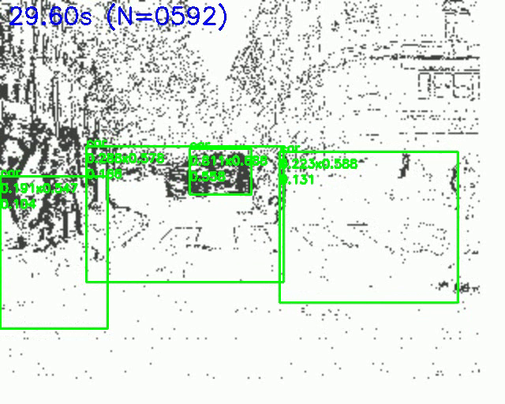

# EFM 强化特征建模模块阶段工作汇报

汇报人：  
指导老师：  
汇报日期：2026 年 4 月 21 日

## 一、当前汇报重点

本阶段汇报重点为本人在事件视觉目标检测任务中设计和实现的 EFM（Enhanced Feature Modeling，强化特征建模）模块。该模块是在现有轻量化事件目标检测框架基础上加入的特征增强结构，目标是在不显著增加模型复杂度的前提下，提升模型对事件数据中有效目标区域、时序变化信息和多尺度特征的建模能力。

事件相机输出的是异步事件流，通常表示为 `(x, y, t, p)`。与传统图像不同，事件数据具有稀疏、噪声较多、目标响应不连续等特点。对于道路场景中的车辆和行人目标，尤其是远距离小目标和弱事件响应目标，模型容易出现漏检、误检和定位偏差。因此，仅依赖原始主干网络提取特征，往往难以充分利用事件流中具有判别性的局部区域和时序变化信息。

基于上述问题，本阶段工作围绕“如何增强事件特征表达能力”展开，重点实现并验证了 EFM 模块。

## 二、EFM 模块设计思路

EFM 模块的核心思路是：利用事件数据本身的稀疏分布和时间变化特点，对主干网络提取到的中间特征进行轻量级增强，使模型更加关注有效事件区域和稳定目标结构。

当前 EFM 模块主要包含三个部分：

| 子模块 | 作用 |
| --- | --- |
| Event Density Gate | 基于事件密度分布增强有效空间区域 |
| Temporal Gate | 利用时序变化信息增强连续事件片段中的目标响应 |
| Multi-scale Fusion | 融合不同尺度特征，提高对车辆、行人和小目标的适应能力 |

### 1. 事件密度感知门控

事件数据并不是均匀分布的。目标边缘、运动区域和背景噪声区域往往具有不同的事件密度模式。EFM 中的事件密度感知门控通过统计输入事件表示在空间位置上的活跃程度，生成事件密度先验，并据此对特征图进行重新加权。

该设计的目的不是简单放大所有事件响应，而是让模型更容易关注可能包含目标结构的区域，减少无效背景和稀疏噪声对检测结果的干扰。

### 2. 时序门控

事件目标检测依赖连续时间片段中的动态信息。单个时间窗口内的事件可能较稀疏，目标轮廓也可能不完整，因此需要利用前后时间片段中的变化趋势来增强目标表达。

时序门控部分用于建模相邻事件片段之间的变化关系，使模型在连续帧中保持更稳定的目标响应。该模块对远距离车辆、行人等弱响应目标具有一定意义，因为这类目标往往需要结合多个时间片段才能形成较完整的结构信息。

### 3. 多尺度特征融合

道路场景中的目标尺度差异较大，既有近距离车辆，也有远距离小目标和行人。EFM 中的多尺度融合部分用于进一步整合不同层级的空间信息，使模型能够同时利用低层细节特征和高层语义特征。

该设计主要服务于小目标检测和复杂背景下的目标定位，希望缓解仅依赖单一尺度特征时容易漏检的问题。

## 三、当前实现情况

目前 EFM 模块已经接入到项目训练配置中，配置文件为：

```text
config/experiment/gen1/efm_tiny_win3060.yaml
```

当前配置中启用的 EFM 相关选项如下：

```yaml
model:
  feature_enhancer:
    enable: true
    density_gate:
      enable: true
      kernel_size: 3
    temporal_gate:
      enable: true
    multi_scale_fusion:
      enable: true
      channel_gate_reduction: 4
      use_residual: true
```

对应的训练权重为：

```text
checkpoint/rnndet_tiny-gen1-bs1_iter400k-efm/models/last_epoch_000-step_19996.ckpt
```

该权重说明 EFM 版本已经能够完成正常训练、保存和后续加载推理。相比只停留在结构设计层面，当前工作已经完成了从模块接入、训练运行到推理展示的闭环验证。

## 四、实验视频生成情况

为了直观展示当前 EFM 模型的检测效果，本次使用已经训练好的 EFM 权重在 Gen1 测试序列上生成了实验可视化视频。

本次使用的推理命令为：

```powershell
python vis_pred.py model=rnndet dataset=gen1 dataset.path=./datasets/gen1/ checkpoint="./checkpoint/rnndet_tiny-gen1-bs1_iter400k-efm/models/last_epoch_000-step_19996.ckpt" +experiment/gen1=efm_tiny_win3060 num_video=2 vis_sequence_length=40 reverse=False show_timestamp=True model.postprocess.confidence_threshold=0.1
```

生成的视频文件为：

```text
vis/gen1_rnndet_tiny/pred/17-06-97_12-14-33_244500000_304500000.mp4
```

视频基本信息如下：

| 项目 | 数值 |
| --- | --- |
| 视频帧数 | 953 帧 |
| 帧率 | 15 FPS |

| 分辨率 | 640 × 512 |
| 使用权重 | `last_epoch_000-step_19996.ckpt` |
| 可视化序列长度 | 40 |

同时截取了一张中间帧作为当前结果预览图：

```text
paper_assets/qualitative/efm_current_result_preview.png
```



## 五、当前结果观察

从生成的视频和预览帧可以观察到，当前 EFM 版本模型已经能够完成测试序列上的前向推理，并输出可视化检测结果。视频中包含事件图像、预测框、类别置信度和对应时间信息，能够用于向老师展示当前模型的实际运行效果。

当前结果可以说明以下几点：

1. EFM 模块已经成功接入模型，并能够随模型权重正常加载和推理。
2. 当前模型能够在 Gen1 道路事件序列上产生连续检测结果，说明训练链路和推理链路均已打通。
3. 模型对部分事件响应明显的目标能够给出检测框，具备初步目标定位能力。
4. 对远距离、小尺度或事件响应较弱的目标，仍然存在漏检和检测不稳定问题。
5. 当前结果适合作为阶段性展示材料，但后续仍需要结合完整验证集指标和消融实验进一步证明 EFM 的性能提升。

## 六、后续工作计划

下一阶段将围绕 EFM 模块继续完成以下工作：

1. 继续训练 EFM 版本模型，观察 `val/AP` 等验证指标是否继续提升。
2. 使用相同训练设置对比原始基线模型和 EFM 模型，形成定量对比表。
3. 分别关闭事件密度门控、时序门控和多尺度融合模块，开展消融实验。
4. 补充更多测试序列可视化视频，展示不同场景下的检测效果。
5. 对小目标漏检、背景误检和定位偏差样例进行分析，作为论文实验分析内容。

## 七、阶段总结

当前阶段已经完成 EFM 强化特征建模模块的设计、配置接入、训练权重保存和实验视频生成。结果表明，EFM 版本模型已经具备可运行、可推理、可展示的基本条件，能够作为后续毕业论文方法部分和实验展示部分的核心内容。

后续工作的重点将从“模块能否运行”转向“模块是否有效提升性能”，即通过完整验证指标、基线对比和消融实验进一步证明 EFM 模块的实际贡献。
